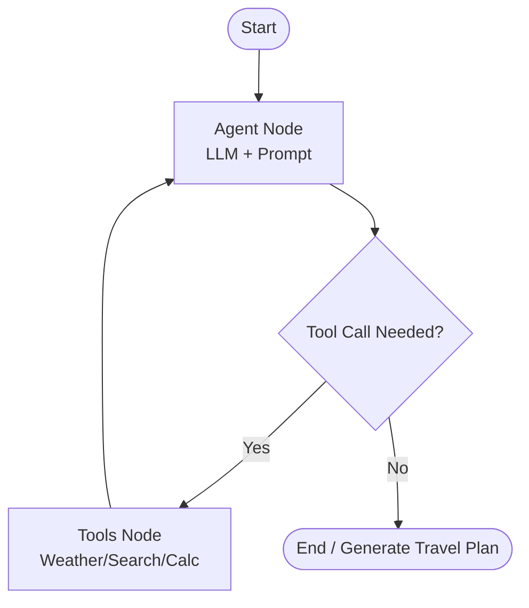

# 🌍 AI Travel Planner (Agentic LangGraph Application)

An advanced, agentic travel planning application built with **LangGraph**, **FastAPI**, and **Streamlit**. The agent utilizes custom tools to dynamically gather weather information, search for places, calculate travel expenses, and perform currency conversions to build the ultimate travel itinerary.

---

## 🚀 Key Features

*   **Agentic LangGraph Workflow:** Powered by a state machine that dynamically routes queries between the LLM and various specialized tools.
*   **Multi-Tool Integration:**
    *   🌦️ **Weather Info Tool:** Provides real-time weather information for destination planning.
    *   🔍 **Place Search Tool:** Recommends attractions, accommodations, and restaurants.
    *   🧮 **Expense Calculator:** Performs detailed budgeting calculations.
    *   💱 **Currency Converter:** Converts travel budgets to local currencies.
*   **FastAPI Backend:** A robust API server handling stateful agent execution.
*   **Interactive Streamlit UI:** A clean, responsive interface to converse with the travel agent.

---

## 🛠️ Tech Stack

*   **Language:** Python >= 3.10
*   **Agent Framework:** LangGraph & LangChain
*   **LLM Provider:** Groq / Custom LLM Loaders
*   **Backend Server:** FastAPI & Uvicorn
*   **Frontend UI:** Streamlit
*   **Environment & Package Manager:** `uv` (extremely fast Python package manager)

---

## 📊 Agent Architecture



---

## ⚙️ Installation & Setup

This project uses `uv` for lightning-fast dependency management.

### 1. Prerequisites
Install `uv` (if you haven't already):
```powershell
pip install uv
```

### 2. Setup the Virtual Environment
Create and activate a virtual environment using `uv`:
```powershell
# Create the virtual environment
uv venv env --python cpython-3.10.18-windows-x86_64-none

# Activate the virtual environment
.\env\Scripts\activate.bat
```

### 3. Install Dependencies
Install all required packages from `requirements.txt`:
```powershell
uv pip install -r requirements.txt
```

### 4. Configuration
Create a `.env` file in the root directory (referencing `.env.name`) and add your API keys:
```env
GROQ_API_KEY=your_groq_api_key_here
```

---

## 🏃 Running the Application

To run the complete system, you need to start both the backend API server and the Streamlit frontend.

### 1. Start the FastAPI Backend
```powershell
uvicorn main:app --reload --port 8000
```
*The backend will be available at `http://localhost:8000`*

### 2. Start the Streamlit Frontend
```powershell
streamlit run streamlit_app.py
```
*The interactive UI will open in your default web browser.*

---

## 📂 Project Structure

```
AI_Trip_Planner/
├── agent/                  # LangGraph architecture & workflows
├── config/                 # Application configuration & loaders
├── exception/              # Custom exception handlers
├── logger/                 # Logging configurations
├── prompt_library/         # Prompt templates for the LLM agent
├── tools/                  # Custom tools (Weather, Currency, Search, Calculator)
├── utils/                  # Helper utilities (document saver, loaders)
├── main.py                 # FastAPI backend entry point
├── streamlit_app.py        # Streamlit frontend application
├── pyproject.toml          # Project configuration
└── requirements.txt        # Python package dependencies
```

---

## 👥 Contributors

*   **ESOHAN** - Creator & Lead Maintainer